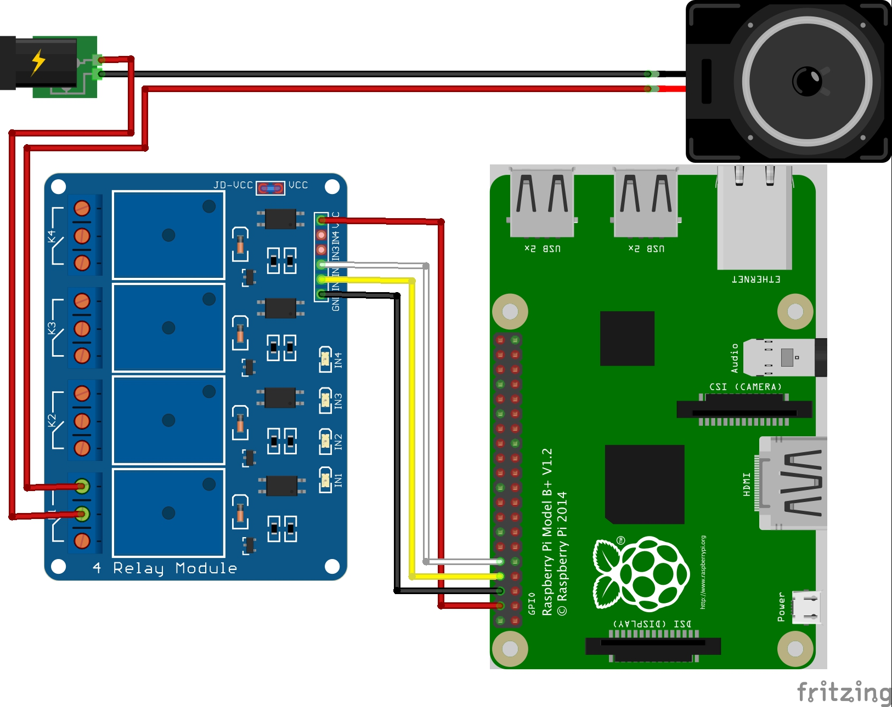
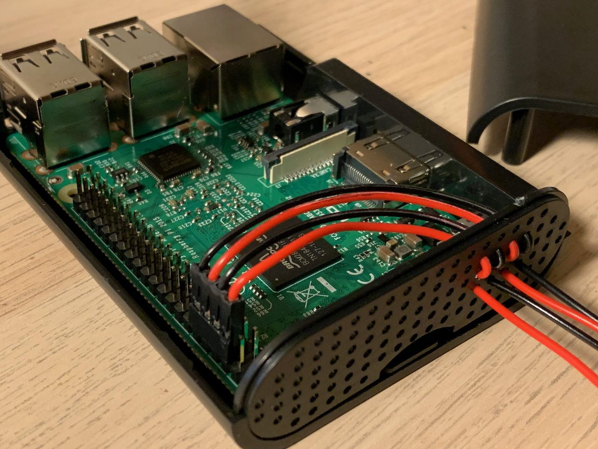
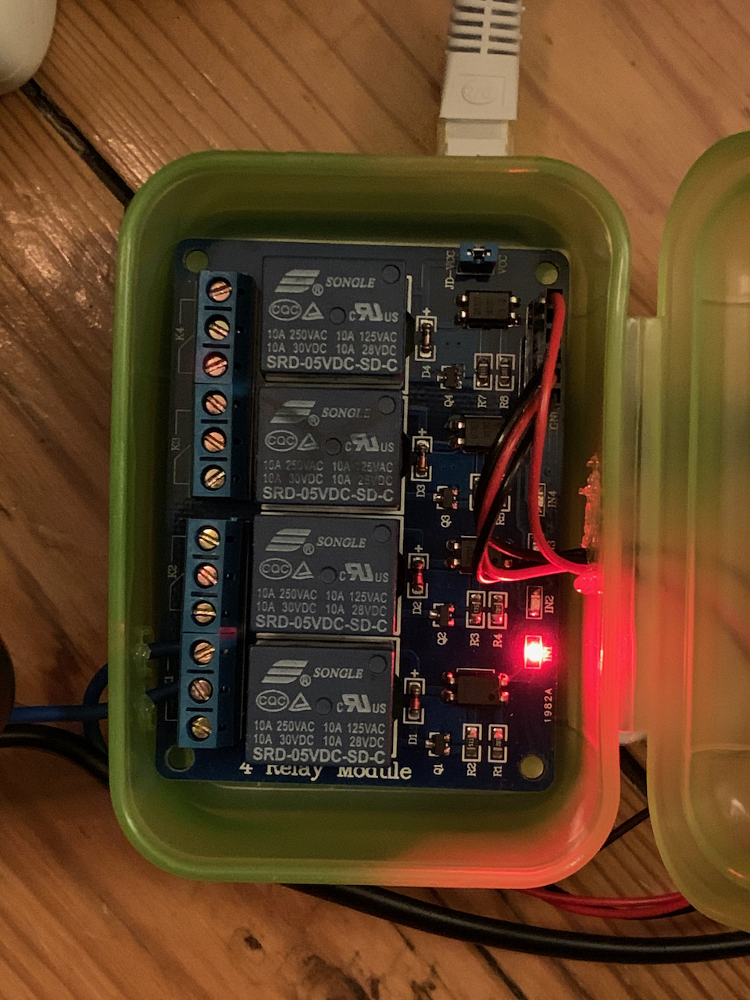
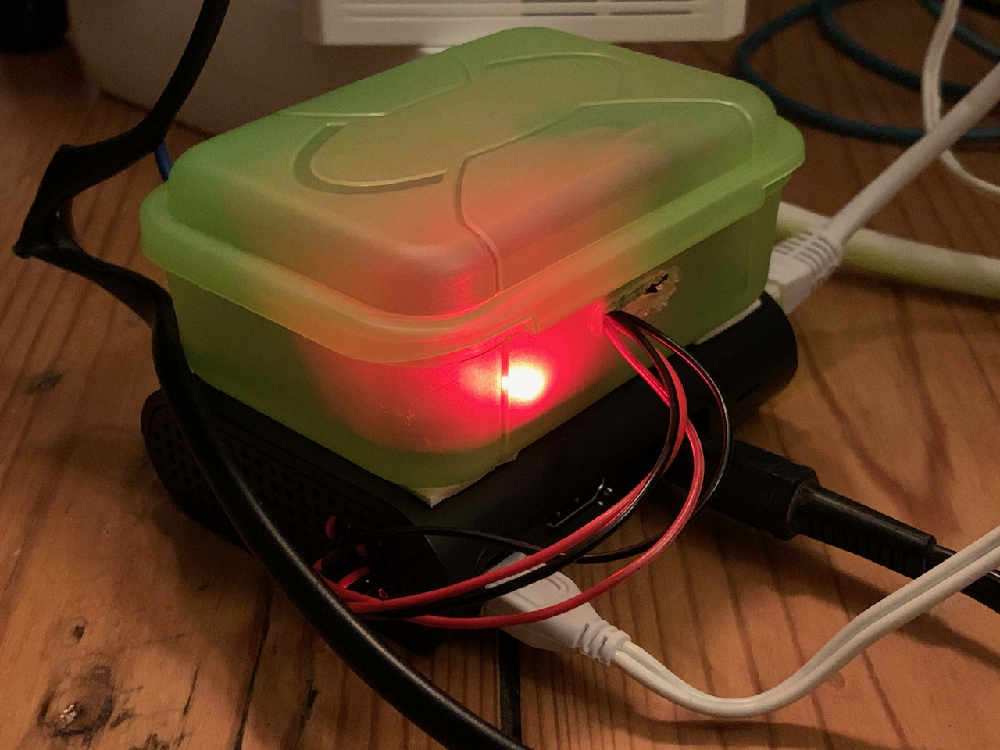

# shairport-power

## Background
I recently got and old pair of speakers, and wanted to set them up to stream wirelessly with [AirPlay](https://www.apple.com/airplay/). One of the best ways to do this with 3rd-party software seems to be to run [shairport-sync](https://github.com/mikebrady/shairport-sync) on a [Raspberry Pi](https://www.raspberrypi.org/).

However, it turned out that my speakers had a bit of a "hum" when no audio was playing, so I needed a way to switch them off when not in use. Also saving a couple of watts of power.

## The finished product
(Youtube Video)

[](http://www.youtube.com/watch?v=Is1vkanx2_s)

# Ingredients
* [Raspberry Pi 3 model B](https://www.amazon.de/gp/product/B01CD5VC92/ref=ppx_yo_dt_b_asin_title_o02_s00?ie=UTF8&psc=1)
* [TP-Link Powerline Adapter](https://www.amazon.de/gp/product/B00ADW9R22/ref=ppx_yo_dt_b_asin_title_o00_s00?ie=UTF8&psc=1)
* [Raspberry Pi Case](https://www.amazon.de/gp/product/B06X99BM44/ref=ppx_yo_dt_b_asin_title_o01_s00?ie=UTF8&psc=1)
* A compatible Relay. I used a [4x relay block](https://www.amazon.de/Elegoo-Relaismodul-Optokoppler-Arduino-Raspberry/dp/B01M8G4Y7Z/ref=sr_1_3?__mk_de_DE=%C3%85M%C3%85%C5%BD%C3%95%C3%91&keywords=arduino+relais+sainsmart&qid=1573939970&sr=8-3) which I had lying around but really you just need [a single one](https://www.amazon.de/AZDelivery-1-Relais-KY-019-High-Level-Trigger-Arduino/dp/B07CNR7K9B/ref=sr_1_7?__mk_de_DE=%C3%85M%C3%85%C5%BD%C3%95%C3%91&keywords=arduino+relay&qid=1573939996&sr=8-7)
* Some [wires](https://www.amazon.de/gp/product/B0144HG2RE/ref=ppx_yo_dt_b_asin_title_o01_s00?ie=UTF8&psc=1)
* Some [female connectors and plugs](https://www.amazon.de/gp/product/B01MRSUEHD/ref=ppx_yo_dt_b_asin_title_o01_s00?ie=UTF8&psc=1)

# Controlling the power



The starting point was [this question](https://github.com/mikebrady/shairport-sync/issues/931) which seemed to do something I wanted. Shairport-sync has a feature which runs a script when music starts or stops, and this was perfect for controlling the power.

I set up the [python script](./scripts/gpioControl.py) to take an `ON` or `OFF` parameter and control the relay switch.

I used [pins 4, 6, 8 and 10](https://www.electronicwings.com/raspberry-pi/raspberry-pi-gpio-access
) on the Raspberry Pi (more convenient, as they're next to each other). Pin 4 supplies power at 5V. Pin 6 is ground, and pin 8 is the I/O for the switch. Pin 10 is connected to a second relay in case I decide to add something else to the system later on.



I ran the wires through the conveniently sized holes in the case, to keep them safe in case they catch on anything.

Then I [set up the relay connection](https://howtomechatronics.com/tutorials/arduino/control-high-voltage-devices-arduino-relay-tutorial/) in a little plastic box on the other end.



And closed it up...



As you can see on the outside, I split the power cable to the speakers, and spliced the relay in the middle of the live wire.

## Configuring the software

I chose the Python [GPIO](https://sourceforge.net/p/raspberry-gpio-python/wiki/BasicUsage/) library because the pin state is retained after the script exits. This isn't the case with [gpiozero](https://gpiozero.readthedocs.io/en/stable/faq.html) (a popular, simpler alternative).

Finally I had to change some configuration parameters in shairport-sync to point to my scripts:

```
...
sessioncontrol =
{
  run_this_before_play_begins = "/home/pi/shairport-power/scripts/gpioControl.py ON";
  run_this_after_play_ends = "/home/pi/shairport-power/scripts/gpioControl.py OFF";
...
```

And restarted the shairport-sync service. On the first run this didn't work, with a syslog error:
```
RuntimeError: No access to /dev/mem.  Try running as root!
```

This requires a [solution](https://raspberrypi.stackexchange.com/questions/40105/access-gpio-pins-without-root-no-access-to-dev-mem-try-running-as-root) to [fix permissions](https://github.com/mikebrady/shairport-sync/issues/775) for the `shairport-sync` user. The following will grant the shairport-sync user permission to use `gpio`:

```
sudo adduser shairport-sync gpio
```

And then a system restart applies the change. Worked the next time around!
